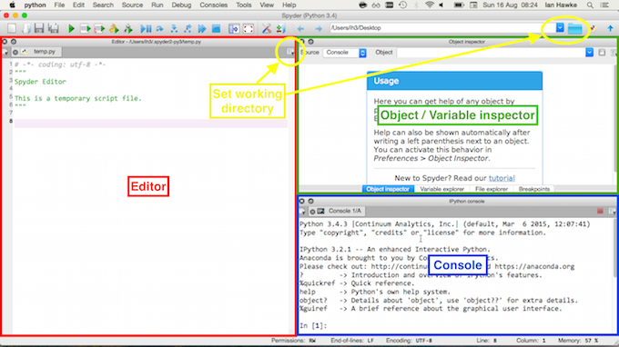

# First steps

Programming is about getting the computer to do the calculation for you. This is needed when the calculation is long and has many repetitive steps. It does *not* mean that you can get the computer to understand things for you: usually you need to understand the steps before telling the computer what to do!

Using a computer, particularly for mathematical or scientific purposes, involves a lot more than programming. There is also

* *Algorithmic thinking*: understanding how to convert the solution to a problem into a sequence of steps that can be followed without further explanation.
* *Efficient implementation* and *complexity*: there are many ways to solve a given problem, which will give equivalent answers in principle. In reality, some solutions will solve some problems to a reasonable accuracy in reasonable time, and it can be important to be able to check which solutions work in which cases.
* *Effective implementation*: solving a problem on a computer *once* is great. Being able to re-use your solution on many problems is much better. Being able to give your code to anybody else, and it working for them, or saying *why* it won't work, without further input from you, is best.
* *Reproducible science*: in principle, any scientific result should be able to be checked by somebody else. With complex scientific code, presenting and communicating its contents so that others can reproduce results is important and not always easy.

First, we will get the computer to do *something*, and later worry about doing it efficiently and effectively. Your time is more valuable than the computer's (literally: compare the [hourly cost of computer time through eg Amazon](https://aws.amazon.com/ec2/pricing/), typically *much* less than $5 per hour, against the minimum wage). We want the computer doing the work, and only when that wastes your time should you worry about the speed of the calculation.

# How to use these notes

## The material

The four essential sections are on the basics, programs, loops and flow control, and basic plotting. You should work through the notes by typing in the commands as they appear, ensuring that you understand what's going on, and seeing where you make mistakes. At the end of each section, try the exercises that you think you can tackle. Also look back at previous exercises and see if you can solve them more straightforwardly with your additional knowledge.

The section on classes should be read before reading the other sections: the details of creating your own classes won't be needed for later sections, but some understanding is important. The section on scientific Python is then the most important and should be explored in detail. At this point you should be able to tackle most of the exercises.

The sections on symbolic Python and statistics should then be covered to get an overview of how Python can be used in these areas. The section on LaTeX is not directly related to programming but is essential for writing mathematical documents. Further sections are useful as your codes get more complex, but initially are less important.

## How to work when coding

When working on code it is often very useful to work in pairs, or groups. Talk about what you're doing, and why you're doing it. When something goes wrong, check with other people, or [explain to them what you're trying to do (rubber duck debugging)](https://en.wikipedia.org/wiki/Rubber_duck_debugging). When working on exercises, [use pair programming techniques](http://www.wikihow.com/Pair-Program). If there's more than one way of doing something, try them all and see which you think is best, and discuss why.

There is no "one right way" to code, but well documented, easy to understand, clearly written code that someone else can follow as well is always a good start.

# Python

To introduce programming we will use the Python programming language. It's a good general purpose language with lots of tools and libraries available, and it's free. It's a solid choice for learning programming, and for testing new code. 

## Using Python on University machines

A number of Python tools are available on a standard university desktop machine. We will mostly be using Python through spyder, which allows us to write, run, test and debug python code in one place. To launch spyder, either type `spyder` in the search bar, or go to `Start`, then `All Programs`, then `Programming Languages`, then `Anaconda`, then choose `spyder`.

## Using Python on your own machine

As Python is free you can install and run it on any machine (or tablet, or phone) you like. In fact, many will have Python already installed, for the use of other software. However, for programming, it is best to have an installation that all works together, which you can easily experiment with, and which won't break other programs if you change something. For these reasons, we recommend you install the [anaconda distribution](http://docs.continuum.io/anaconda/).

### Anaconda

If you have enough bandwidth and time (you will be downloading about 1G of software) then you can use the [Anaconda graphical installer](https://www.continuum.io/downloads). There are two versions of Python: a Python `2.X` and a Python `3.X`. There are small differences between the two. Everything we show here will work on either version. We will be using the `3.X` version.

The Anaconda package installs both the essential Python package and a large amount of useful Python software. It will put a launcher icon on your desktop. Clicking on the launcher will bring up a window listing a number of applications: we will be using `spyder` as seen below.

### miniconda

If you do not want to download all the Python packages, but only the essential ones, there is a smaller version of Anaconda, called miniconda. First, [download the miniconda package](http://conda.pydata.org/miniconda.html) for your computer. Again, we will be using the `3.X` version.

The miniconda package installs the basic Python and little else. There are a number of useful packages that we will use. You can install those using the `conda` app (either via the launcher, or via the command line). But before doing that, it is best to create an environment to install them in, which you can modify without causing problems.

### Environments

Packages may rely on other packages, and may rely on *specific versions* of other packages in order to work. This can lead to "dependency hell", when you need (for different purposes) package `A` and package `B` which rely on conflicting versions of package `C`.

The answer to this is *environments*, which allow you to organize your different packages to minimize conflicts. Environments are like folders, and you have one for each project you are working on. That way, you ensure that updating or installing packages for one project does not cause problems for a different project.

To get the most out of environments, we need to use the command line, or terminal.

#### Terminals

A *terminal*, or a [*command prompt window*](http://windows.microsoft.com/en-gb/windows-vista/open-a-command-prompt-window), is a window where commands can be typed in to directly run commands or affect files. On Windows you select the `Command Prompt` from the Accessories menu. On Mac or Linux system you open a terminal or an XTerm. Inside the terminal you can change directories using the `cd` command, and run commands associated with Anaconda or miniconda using the `conda` command.

#### Creating the environment

We will create a single environment called `labs`. If you are running on a Mac or on Linux, open a terminal. If on Windows, use a command prompt. Then type

```bash
conda create -n labs python=3
```

This creates the new environment, and installs the basic `python` package in the `python 3.X` flavour. It does not activate the environment. In order to work within this environment, if using Windows type

```bash
activate labs
```

If using Mac or Linux type

```bash
source activate labs
```

Then any command launched from the terminal or command prompt will use the packages in this environment.

### Packages

After creating the environment, and activating it, the key packages that need installing (if using miniconda; they are all installed with the full Anaconda) are:

* `ipython`
* `numpy`
* `matplotlib`
* `scipy`
* `spyder`
* `spyder-app`
* `sympy`

Other packages that will be useful are

* `jupyter`
* `nose`
* `numba`
* `pandas`

The command to install new packages is `conda install`. So, to install the packages above type (or copy and paste) first

```bash
activate labs
```

if on Windows, or 

```bash
source activate labs
```

if on Mac or Linux, and then type

```bash
conda install ipython numpy matplotlib scipy spyder spyder-app sympy \
 jupyter nose numba pandas
```

**Note**: the '`\`' backslash character should continue an overly long line: if you are typing and not copying and pasting this should be unnecessary.

This will download and install a lot of additional packages that are needed; just agree and continue.

# Spyder

There are many ways of writing and running Python code. If you open a terminal (on Mac or Linux; on Windows, this would be a Command Prompt) you can type `python` or `ipython` to launch a very bare bones *console*. This allows you to enter code which it will then run.

More helpful alternatives are *Integrated Development Environments* (IDEs) or the *notebook*. The [Jupyter notebook](https://jupyter.org/) (previously called the [IPython notebook](http://ipython.org/notebook.html)) is browser based and very powerful for exploratory computing. To run, type `jupyter notebook` in the terminal prompt.

However, when just getting started, or when writing large codes, IDEs are a better alternative. A simple IDE is `spyder` which we will use here. To launch, either select `spyder` from the appropriate menu, or type `spyder` at the terminal prompt.

You should then see a screen something like the figure (without the annotations).



The four essential parts of the screen are outlined.

1. The console (bottom right, marked in blue). You can work *interactively* here. Code run, either interactively or from the editor, will output any results here. Error messages will be reported here. There are two types of console: a Python console, and an IPython console. Both will run Python code, but the IPython console is easier to use.
2. The editor (left, marked in red). You can write code to be saved to file or run here. This will suggest problems with syntax and has features to help debug and give additional information.
3. The inspector (top right, marked in green). Can display detailed help on specific objects (or functions, or...) - the *Object inspector*, or can display detailed information on the variables that are currently defined - the *Variable inspector*. Extremely useful when debugging.
4. The working directory (marked in yellow). When running a code this is the first place that `spyder` looks. You should ensure that the working directory is set to the location where the file is.

For further information on using and setting up `spyder`, see [this tutorial](http://www.southampton.ac.uk/~fangohr/blog/spyder-the-python-ide.html).

## Tab completion

A crucial feature of IPython and spyder that saves time and reduces errors is *tab completion*. When typing anything, try pressing the tab key. This will either automatically complete the name of the variable (or function, or class), or will present a list of options. This is one way of finding out what functions are available - press tab and it will list them all! By typing the first few characters and then pressing tab, you can rapidly narrow down the options.

## Help

There are many ways of getting help. The most useful are:

* Type `help(<thing>)`. Works in the console.
* Type `<thing>?` or `<thing>??`. Works in the console.
* Type the name in the Object Inspector. Works in spyder only.
* Google it. Pay particular attention to the online documentation and sites such as stackoverflow.

# Reading list

There's a lot of material related to Python online and in the library. None are essential, but lots may be useful. The particular books recommended as a first look are

* Langtangen, *A Primer on Scientific Programming with Python*. Detailed, aimed more towards mathematicians than many others.
* Newman, *Computational Physics*. Really aimed at teaching numerical algorithms rather than programming, but there's lots of useful examples at a good level.
* Scopatz & Huff, *Effective Computation in Physics*. Covers a lot more material than just Python, not exactly aimed at mathematics, but essential background for computational research in the sciences.
* Saha, *Doing Math with Python*. Covers more symbolic mathematics and assumes more Python background, but has lots of excellent exercises at the right level.

# Versions

These notes have been constructed using the following versions of Python and related packages:


{:.input_area}
```python
%load_ext watermark
%watermark -v -m -g -p numpy,scipy,matplotlib,sympy
```


{:.output .output_stream}
```
CPython 3.4.4
IPython 4.1.1

numpy 1.10.4
scipy 0.17.0
matplotlib 1.5.1
sympy 0.7.6.1

compiler   : GCC 4.2.1 (Apple Inc. build 5577)
system     : Darwin
release    : 14.5.0
machine    : x86_64
processor  : i386
CPU cores  : 4
interpreter: 64bit
Git hash   : c8886df0783a20e915cec64c793a4f8962b1c889

```
